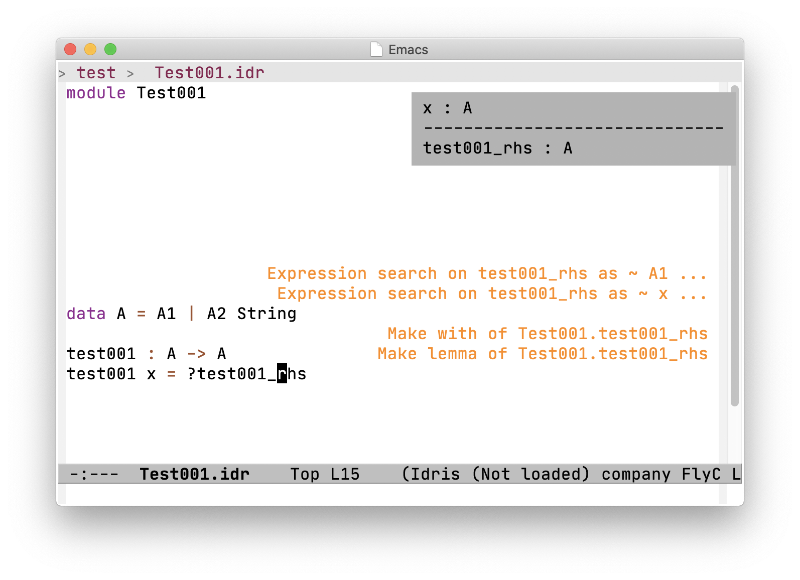

# lsp-idris2

lsp-idris2 is LSP client for Idris2.
To run this mode, you need to install 
- Idris2 (https://github.com/idris-lang/Idris2)
 To build idris2-lsp, you may need to build and install idris2 and idris2-api.
- idris-mode (https://github.com/emacsmirror/idris-mode)
- idris2-lsp (https://github.com/idris-community/idris2-lsp)


# Configurtion

The following setting by use-package in .emacs.d/init.el worked for me.

```
(progn
  (use-package idris-mode
    :load-path "site-lisp/idris-mode"
    :mode "\\.idr"
    :config
    (customize-set-variable 'idris-interpreter-path "~/.idris2/bin/idris2")
    
    (customize-set-variable 'idris-stay-in-current-window-on-compiler-error t)
    (customize-set-variable 'idris-command-line-option-functions
			  '((lambda () (list
					"-p base" "-p idris2" "-p contrib" "-p network" "--no-color")))))
  (use-package lsp-mode
    :ensure t
    :hook (idris-mode . lsp)
    :commands lsp)
  (use-package lsp-idris2
    :load-path "site-lisp/lsp-idris2"
    :config
    (add-hook 'idris-mode-hook #'lsp)
    (add-hook 'idris-literate-mode-hook #'lsp)
    (custom-set-variables '(lsp-idris2-server-path "path to idris2-lsp in your environment")))
  (use-package helm-idris
    :defer t
    :ensure t))
```

In the above configuration I put lsp-idris2.el in .emacs.d/site-lisp/lsp-idris2/.

# Screen Shots

